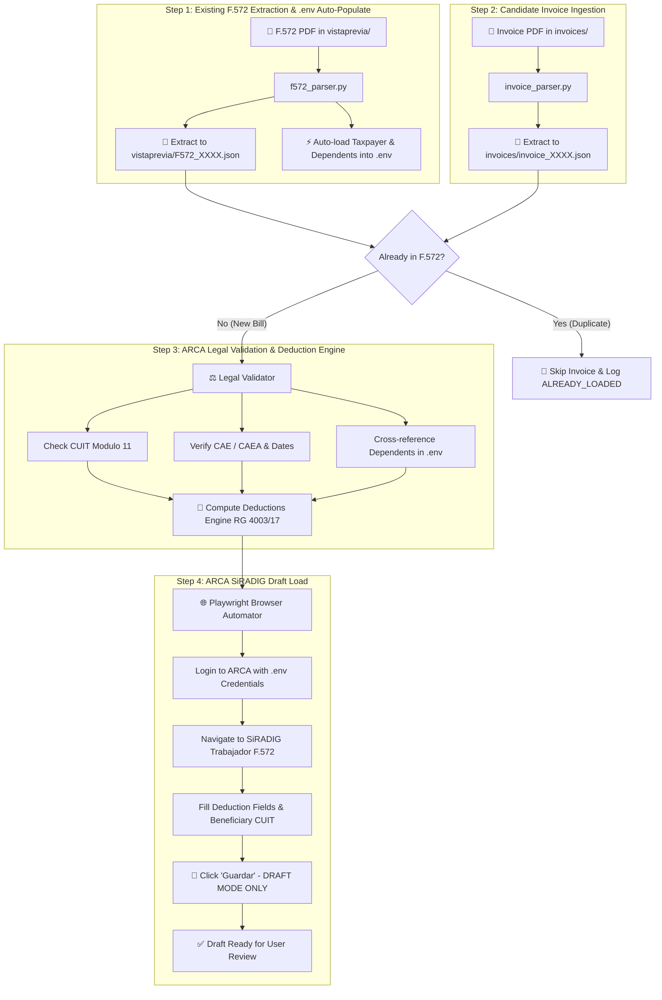

# ARCA / AFIP SiRADIG F.572 Web Automation Agent 🇦🇷
NOT READY TO USE. WIP!
This repository equips the **Antigravity AI Agent** with the skill to parse, legally validate, deduplicate, and load tax deduction invoices (*facturas*) into **ARCA / AFIP - SiRADIG Trabajador (Formulario 572 Web)** in **Draft mode** (`Borrador`).

---

## 📊 Complete Automation & Validation Workflow



---

## 🆕 `vistaprevia/` PDF Evaluation & `.env` Auto-Sync

1. **Step 1 - F.572 PDF Extraction & `.env` Sync**:
   Place your existing F.572 "Vista Previa" export PDF inside `vistaprevia/` (e.g. `vistaprevia/F572_2026.pdf`).
   - The skill extracts loaded items into `vistaprevia/F572_2026.json`.
   - **Automatic `.env` Sync**: Automatically extracts the taxpayer CUIL, fiscal year, and all registered family dependents (CUITs, names, surnames) and populates/syncs them into your `.env` configuration file!

2. **Step 2 - Duplicate Check**: Before uploading any new invoice from `invoices/`, the agent checks whether the receipt (CUIT prestador, Punto de Venta, Número) is already loaded in the F.572. If present, it skips the bill to prevent double entry!

---

## 🚀 Quick Setup

### 1. Configure Environment Credentials
Copy `.env.example` to `.env`:
```bash
cp .env.example .env
```
Fill in your credentials in `.env` (it is protected by `.gitignore`):
```env
ARCA_CUIL=20123456789
ARCA_CLAVE_FISCAL=TuClaveFiscalSegura
TAXPAYER_NAME=Juan Perez
FISCAL_YEAR=2026

# Dependents (Hijos / Hijas)
DEPENDENT_1_FIRST_NAME=Mateo
DEPENDENT_1_LAST_NAME=Perez
DEPENDENT_1_CUIT=20551234569
DEPENDENT_1_RELATIONSHIP=HIJO
DEPENDENT_1_BIRTH_DATE=2018-04-12
```

### 2. Install Dependencies
```bash
pip install -r requirements.txt
playwright install chromium
```

---

## 📁 Repository Structure

```
agente_arca/
├── .env.example              # Credentials and dependents template
├── .env                      # Local secret variables (Git-ignored)
├── .gitignore                # Git protection rules
├── SKILL.md                  # Comprehensive skill specification
├── mcp_tools_schema.json     # MCP tool declarations
├── vistaprevia/              # 📍 F.572 "Vista Previa" PDFs & extracted JSONs
├── invoices/                 # 📍 Invoice PDFs & extracted JSONs
├── config/
│   └── settings.py           # Configuration loader
├── src/
│   ├── parser/               # Invoice & F.572 PDF extractors (+ .env auto-sync)
│   ├── validator/            # Legal CUIT, CAE, dates & duplicate checker
│   ├── engine/               # Tax deduction calculator (RG 4003/17)
│   └── browser/              # Playwright browser automator for SiRADIG
└── tests/                    # Unit tests for tax logic & duplicates
```
