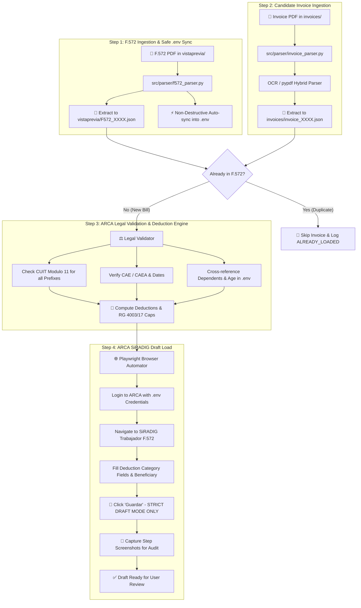

# ARCA / AFIP SiRADIG F.572 Web Automation Agent 🇦🇷

This repository equips the **Antigravity AI Agent** with the skill to parse, legally validate, deduplicate, compute annual fiscal caps (under **RG 4003/17**), and load tax deduction invoices (*facturas*) into **ARCA / AFIP - SiRADIG Trabajador (Formulario 572 Web)** strictly in **Draft mode** (`Borrador`).

---

## 📊 Complete Automation & Validation Workflow



---

## 🚀 Quick Setup & Usage

### 1. Configure Environment Credentials
Copy `.env.example` to `.env`:
```bash
cp .env.example .env
```
Fill in your credentials in `.env` (it is protected by `.gitignore`):
```env
ARCA_CUIL=20123456789
ARCA_CLAVE_FISCAL=TuClaveFiscalSegura
TAXPAYER_NAME=Juan Perez
FISCAL_YEAR=2026

# Dependents (Hijos / Hijas)
DEPENDENT_1_FIRST_NAME=Mateo
DEPENDENT_1_LAST_NAME=Perez
DEPENDENT_1_CUIT=20551234569
DEPENDENT_1_RELATIONSHIP=HIJO
DEPENDENT_1_BIRTH_DATE=2018-04-12
```

### 2. Install Dependencies
```bash
pip install -r requirements.txt
playwright install chromium
```

---

## 💻 CLI Commands

Run the full end-to-end pipeline or individual steps using `main.py`:

> ⚠️ **Fiscal caps (MNI/GNA)**: Values for fiscal years 2025–2026 in
> `src/engine/deduction_calculator.py` (`FISCAL_YEAR_DEFAULT_CAPS`) are **IPC projections,
> not official AFIP figures**. The engine logs a warning whenever estimated caps are used.
> Override them via `custom_caps` / config once AFIP publishes the official values.

```bash
# 1. Sync F.572 export PDF to .env safely (preserves comments)
python main.py sync-f572

# 2. Extract structured JSON from candidate invoices
python main.py parse-invoices

# 3. Validate invoices & compute RG 4003/17 annual caps
python main.py validate --output-json summary.json

# 4. Upload valid drafts into SiRADIG (Interactive / Visual)
python main.py upload-draft

# 5. Run full pipeline end-to-end
python main.py pipeline --upload-draft
```

---

## 🔌 MCP Server (Model Context Protocol)

To connect this agent to Claude, Gemini, or Antigravity via MCP:

```bash
python src/mcp/server.py
```

Exposes 4 standard tools:
1. `parse_and_extract_invoice`: Extracts tax details from PDF/images.
2. `validate_deduction_eligibility`: Validates CUIT, CAE, dates, and dependent relations.
3. `compute_deductions_engine`: Computes deductible amount and enforces annual MNI/GNA caps.
4. `generate_siradig_payload`: Compiles all deductions into standard SiRADIG JSON payload.

---

## 📁 Repository Structure

```
agente_arca/
├── LICENSE                   # MIT License
├── .env.example              # Credentials and dependents template
├── .env                      # Local secret variables (Git-ignored)
├── .gitignore                # Git protection rules
├── main.py                   # Standalone CLI orchestrator
├── SKILL.md                  # Comprehensive skill specification
├── mcp_tools_schema.json     # MCP tool declarations
├── vistaprevia/              # 📍 F.572 "Vista Previa" PDFs & extracted JSONs
├── invoices/                 # 📍 Invoice PDFs & extracted JSONs
├── config/
│   └── settings.py           # Configuration loader
├── src/
│   ├── models/               # Pydantic data schemas
│   ├── parser/               # Invoice & F.572 PDF extractors (+ safe .env sync)
│   ├── validator/            # Legal CUIT, CAE, dates & duplicate checker
│   ├── engine/               # Tax deduction calculator & annual caps (RG 4003/17)
│   ├── browser/              # Playwright browser automator for SiRADIG
│   ├── utils/                # Structured logging, secret masking & safe env manager
│   └── mcp/                  # FastMCP / JSON-RPC server for LLM tools
└── tests/                    # Comprehensive unit & integration test suite
```

---

## 📄 License

This project is licensed under the **[MIT License](LICENSE)** © 2026 Gabriel Benselum.

### Third-Party Licenses & Notices
- **Playwright**, **pytesseract**: Licensed under [Apache 2.0](https://www.apache.org/licenses/LICENSE-2.0).
- **pypdf**, **python-dotenv**: Licensed under [BSD-3-Clause](https://opensource.org/licenses/BSD-3-Clause).
- **Pillow**: Licensed under [HPND / MIT-CMU](https://pillow.readthedocs.io/en/stable/releasenotes/index.html).
- **Pydantic**: Licensed under [MIT](https://opensource.org/licenses/MIT).
- **PyMuPDF** (optional OCR rasterizer fallback): Dual-licensed under [GNU AGPLv3](https://www.gnu.org/licenses/agpl-3.0.html) and Commercial terms. Used solely as an optional import.
- **Argentine Fiscal Norms & Formulas** (RG 4003/17, CUIT Modulo 11): Argentine public legal provisions (*Ley 11.723, Art. 28*).

